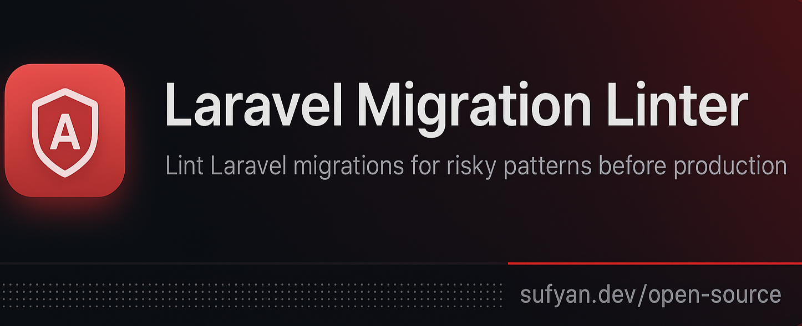

<p>
  
</p>

# 🧩 Laravel Migration Linter  
[](https://muhammad-sufyan5.github.io/sufyan-laravel-migration-lint-package/)
[](https://github.com/muhammad-sufyan5/sufyan-laravel-migration-lint-package/actions)
[](https://packagist.org/packages/sufyandev/laravel-migration-linter)
[](https://packagist.org/packages/sufyandev/laravel-migration-linter)
[](#)
[](#)
[](#)
[](LICENSE)

A lightweight Laravel package that **analyzes your database migrations** and warns you about risky schema changes — before they reach production.  

---

## 🚀 Features
- 🔍 Detects dangerous migration patterns:
  - Non-nullable columns without defaults  
  - Missing indexes on foreign keys  
  - Unsafe column drops  
  - Risky unique constraints  
  - Floating-point money fields
- ⚙️ Configurable rule severities (`info`, `warning`, `error`)
- 💡 **Actionable suggestions** — Each warning includes fix recommendations
- 🔗 **Documentation links** — Every suggestion has a link to detailed docs
- 🧠 Baseline support to ignore legacy issues
- 🧾 JSON or table output for CI/CD (with suggestions included)
- 🧩 Fully documented & tested (v1.4.0)

📘 **Read full rule docs:**  
👉 [https://muhammad-sufyan5.github.io/sufyan-laravel-migration-lint-package/](https://muhammad-sufyan5.github.io/sufyan-laravel-migration-lint-package/)

---

## 📦 Installation
Install via Composer:  
```bash
composer require sufyandev/laravel-migration-linter --dev
```
The package will auto-register via Laravel’s package discovery.

---

## 🧩 Usage

Run the built-in Artisan command to lint all migration files:

```bash
php artisan migrate:lint
```

### Common Options

| Option                | Description                                |
| --------------------- | ------------------------------------------ |
| `--json`              | Output structured JSON (great for CI)      |
| `--path=`             | Lint a specific migration file/folder      |
| `--baseline`          | Use a custom baseline file                 |
| `--generate-baseline` | Create a baseline to ignore current issues |
| `--rules`             | View all rules and their enabled status    |
| `--summary`           | Display summary footer in output           |

### Example Usage

Lint all migrations and export JSON:
```bash
php artisan migrate:lint --json > storage/lint-report.json
```

Generate a new baseline file (ignore current issues):
```bash
php artisan migrate:lint --generate-baseline
```

Sample warning output:
```
[warning] AddUniqueConstraintOnNonEmptyColumn
→ Adding unique constraint to 'email' may fail if duplicates exist in 'users'.
```

---

## 📋 Scope & Limitations

### What We Analyze
✅ **Laravel Schema Builder Operations** — All `$table->` method calls  
✅ **Schema::create()** and **Schema::table()** methods  
✅ **Column modifications** via `->change()`  
✅ **Foreign keys**, **indexes**, **constraints**, **timestamps**  

### What We Don't Analyze (By Design)
⚠️ Raw SQL queries (`DB::statement()`, `DB::raw()`, etc.)  
⚠️ Direct Eloquent operations (`User::update()`, model factories)  
⚠️ Model traits and properties  
⚠️ Data seeding operations  

**Reason:** The linter focuses on statically analyzing schema builder patterns, which represent 99% of migration files. Raw SQL analysis requires different tooling.
---

## ⚙️ Configuration

You can publish the configuration file to customize rule settings:

```bash
php artisan vendor:publish --tag="migration-linter-config"
```

The config file (`config/migration-linter.php`) allows you to:
- Set severity threshold (`info`, `warning`, `error`)
- Enable/disable specific rules
- Customize rule severity levels

Example configuration:
```php
return [
    'severity_threshold' => 'warning',
    'rules' => [
        'AddNonNullableColumnWithoutDefault' => ['enabled' => true, 'severity' => 'warning'],
        'MissingIndexOnForeignKey'           => ['enabled' => true, 'severity' => 'warning'],
        // ... other rules
    ],
];
```
---

## 🧾 CI/CD Integration (GitHub Actions)

```yaml
name: Laravel Migration Linter
on: [push, pull_request]
jobs:
  lint:
    runs-on: ubuntu-latest
    steps:
      - uses: actions/checkout@v4
      - uses: shivammathur/setup-php@v2
        with:
          php-version: 8.3
      - run: composer install --no-interaction
      - run: php artisan migrate:lint --json > lint-report.json
```
---

## � What's New in v1.4.0

- ✨ **Suggestions System** — Each warning includes actionable fix recommendations
- 🔗 **Documentation Links** — Every issue links to detailed docs for the rule
- ✅ **SoftDeletesOnProduction** — New rule for detecting unsafe soft deletes on large tables
- 📊 **Enhanced Reporter** — JSON and table output include suggestions
- ✅ 100% test coverage with 43 passing tests

---

## 🧑‍💻 Contributing
Contributions are welcome!
If you have an idea for a useful rule or enhancement, feel free to open a PR or issue.

---

## 🧾 License
Released under the MIT License.
© 2025 Sufyan. All rights reserved.

---

## 🧠 Author
Muhammad Sufyan
📧 muhammadsufyanwebdeveloper@gmail.com
🐙 GitHub: @muhammad-sufyan5

“Smart developers don’t debug production — they lint migrations.”

📘 **Full Documentation:**  
👉 [https://muhammad-sufyan5.github.io/sufyan-laravel-migration-lint-package/](https://muhammad-sufyan5.github.io/sufyan-laravel-migration-lint-package/)
