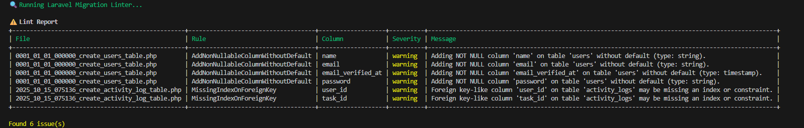

<h2>📸 Screenshot</h2>
<p>
  
</p>
  <sub>Screenshot from v1.0.0</sub>


# 🧩 Laravel Migration Linter  
[](https://github.com/muhammad-sufyan5/sufyan-laravel-migration-lint-package/actions)
[](https://packagist.org/packages/sufyandev/laravel-migration-linter)
[](https://packagist.org/packages/sufyandev/laravel-migration-linter)
[](LICENSE)

A lightweight Laravel package that **analyzes your database migrations** and warns you about risky schema changes — before they reach production.  

---

## 🚀 Features
✅ Detects dangerous migration operations (like adding non-nullable columns without defaults).  
✅ Warns about missing indexes on foreign key columns.  
✅ Configurable rule severities (info, warning, error).  
✅ Baseline support to ignore known legacy issues.  
✅ CLI report with JSON output & colorized table.  
✅ Ready for CI/CD integration (GitHub Actions support).  

---

## 📦 Installation
Install via Composer:  
```bash
composer require sufyandev/laravel-migration-linter --dev
```
The package will auto-register via Laravel’s package discovery.

---

🧩 Usage
Run the built-in Artisan command to lint all migration files:

```bash
php artisan migrate:lint
```
### You can use the following flags and options to customize behavior:

| Option / Flag         | Description                                                                                                                                                                        |
| --------------------- | ---------------------------------------------------------------------------------------------------------------------------------------------------------------------------------- |
| `--generate-baseline` | Create a JSON file (`migration-linter-baseline.json`) that records all current issues so they can be ignored in future runs. Useful for introducing the linter to legacy projects. |
| `--path=`             | Lint a specific migration file or directory instead of the default `database/migrations` folder.                                                                                   |
| `--json`              | Output results in structured JSON format (great for CI/CD pipelines).                                                                                                              |
| `--baseline=`         | Provide a custom path to a baseline file for ignoring known issues (overrides the default `migration-linter-baseline.json`).                                                       |


Example Usage

### Lint all migrations
```bash
php artisan migrate:lint
```
### Generate a new baseline file (ignore current issues)
```bash
php artisan migrate:lint --generate-baseline
```
### Run only on a specific path
```bash
php artisan migrate:lint --path=database/migrations/2024_01_01_create_users_table.php
```
### Export lint report as JSON (for CI)
```bash
php artisan migrate:lint --json > storage/lint-report.json
```
### Use a custom baseline file
```bash
php artisan migrate:lint --baseline=storage/custom-baseline.json
```

## ⚙️ Publishing Configuration

You can publish the configuration file to customize rule settings:

```bash
php artisan vendor:publish --tag="migration-linter-config"
```
This creates:
config/migration-linter.php

## ⚙️ Configuration

Default config file (config/migration-linter.php):
```bash
return [
    'severity_threshold' => 'warning',

    'rules' => [
        'AddNonNullableColumnWithoutDefault' => [
            'enabled'  => true,
            'severity' => 'warning',
        ],
        'MissingIndexOnForeignKey' => [
            'enabled'  => true,
            'severity' => 'warning',
        ],
    ],
];
```

## 🧰 GitHub Actions Integration
Add this workflow file: .github/workflows/migration-linter.yml
```bash
name: Laravel Migration Linter
on: [push, pull_request]
jobs:
  lint:
    runs-on: ubuntu-latest
    steps:
      - uses: actions/checkout@v4
      - uses: shivammathur/setup-php@v2
        with: { php-version: 8.3 }
      - run: composer install --no-interaction
      - run: php artisan migrate:lint --json > lint-report.json

```
---

## 🧑‍💻 Contributing
Contributions are welcome!
If you have an idea for a useful rule or enhancement, feel free to open a PR or issue.

---

## 🧾 License
Released under the MIT License.
© 2025 Sufyan. All rights reserved.

---

## 🧠 Author
Muhammad Sufyan
📧 muhammadsufyanwebdeveloper@gmail.com
🐙 GitHub: @muhammad-sufyan5

“Smart developers don’t debug production — they lint migrations.”