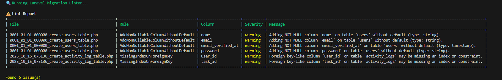

---
title: Introduction
layout: default
---

# 🧩 Laravel Migration Linter  

A lightweight Laravel package that **analyzes your database migrations** and warns you about risky schema changes — before they reach production.  

---

## 🚀 Features
✅ Detects dangerous migration operations (like adding non-nullable columns without defaults).  
✅ Warns about missing indexes on foreign key columns.  
✅ Warns when columns are dropped (data loss risk).  
✅ Warns when float() is used for money fields (precision issue).  
✅ Warns when adding unique constraints to existing data.   
✅ Configurable rule severities (info, warning, error).  
✅ Baseline support to ignore known legacy issues.  
✅ CLI report with JSON output & colorized table.  
✅ Ready for CI/CD integration (GitHub Actions support).  

<h2>📸 Screenshot</h2>

  

  Screenshot from v1.0.0